# 📍 Location-Based XR (GPS + Heading 기반 실외 XR 배치)

> **모바일 GPS(위도/경도)와 HMD Heading을 결합해, 목표 지점(랜드마크) 기준으로 XR 오브젝트를 실외에서 방향 정렬하여 배치하는 Location-based XR 프로토타입(Unity + Quest 3)** 입니다.  
> “도착 → 반경 진입 확인 → 콘텐츠 배치” 흐름을 재현 가능한 구조로 구현했습니다.

 

## 📸 Project Showcase

 

## 📝 Introduction

실외 XR에서는 **절대 위치(GPS)** 와 **절대 방향(Heading)** 기준이 불안정해, XR 오브젝트가 엉뚱한 위치/방향으로 배치되기 쉽습니다.  
본 프로젝트는 모바일 GPS로 위치를 확보하고, HMD의 초기 Heading을 기준으로 북쪽 정렬을 적용해 **현장 좌표계**를 구성하여, 목표 지점에 콘텐츠를 안정적으로 배치하는 파이프라인을 제공합니다.

### Key Features
- **GPS 수신/권한 처리**: Android Location 기반 위도/경도 수신 및 UI 표시
- **근접 판정(Geofence)**: Haversine 거리 계산으로 반경 진입 조건 처리
- **위경도 → 로컬 XZ 변환**: 지구 반경 근사 기반 좌표 변환으로 배치 위치 계산
- **Heading 기반 정렬**: 초기 Heading 캡처 후 북쪽 기준 정렬 및 방향 보정
- **안정화 로직**: 급격한 방향 변화 감지 시 재설정(Scene Reload 등)으로 배치 안정성 확보

 

## 🏗 System Architecture

```mermaid
%%{
  init: {
    'flowchart': { 'nodeSpacing': 50, 'rankSpacing': 100, 'arrowMarkerAbsolute': true, 'arrowMarkerSize': 20 },
    'theme': 'base',
    'themeVariables': {
      'primaryColor': '#ffffff',
      'primaryTextColor': '#000000',
      'primaryBorderColor': '#000000',
      'lineColor': '#000000',
      'secondaryColor': '#ffffff',
      'tertiaryColor': '#ffffff',
      'background': '#ffffff',
      'mainBkg': '#ffffff',
      'nodeBorder': '#000000',
      'clusterBkg': '#ffffff',
      'clusterBorder': '#000000',
      'defaultBkg': '#ffffff',
      'titleColor': '#000000',
      'edgeLabelBackground':'#ffffff',
      'fontSize': '16px'
    }
  }
}%%

flowchart LR

classDef InputStyle fill:#ffffff,stroke:#1d4ed8,stroke-width:2px,color:#000000;
classDef LogicStyle fill:#ffffff,stroke:#16a34a,stroke-width:2px,color:#000000;
classDef XrStyle fill:#ffffff,stroke:#000000,stroke-width:2px,color:#000000;
classDef OutputStyle fill:#ffffff,stroke:#7c3aed,stroke-width:2px,color:#000000;

subgraph Pipeline["Location-based XR Pipeline"]
direction LR

subgraph Mobile["모바일 GPS 수신"]
direction TB
GetLocation["GetLocation.cs<br/>Permission + Input.location"]:::InputStyle
end

subgraph Geo["위치 처리"]
direction TB
GPSManager["GPSManager.cs<br/>위도/경도 저장"]:::LogicStyle
Proximity["ProximityChecker.cs<br/>Haversine 거리 계산"]:::LogicStyle
end

subgraph XR["XR 배치"]
direction TB
Heading["LocationToPosition.cs<br/>초기 Heading 캡처"]:::XrStyle
GeoToXZ["LocationToPosition.cs<br/>위경도 → 로컬 XZ"]:::XrStyle
AlignNorth["LocationToPosition.cs<br/>북쪽 기준 정렬"]:::XrStyle
PlaceObj["LocationToPosition.cs<br/>Prefab Instantiate"]:::XrStyle
end

subgraph Stabilize["안정화"]
direction TB
Reset["DirectionChangeDetector.cs<br/>급변 감지 후 재설정"]:::LogicStyle
end

Output["XR 오브젝트 배치 완료"]:::OutputStyle

GetLocation --> GPSManager --> Proximity --> Heading --> GeoToXZ --> AlignNorth --> PlaceObj --> Output
Reset --> Output

end

linkStyle default stroke-width:3px,stroke:black;
```

 

## 🛠 Tech Stack

| Category | Technology | Description |
| --- | --- | --- |
| **Engine** | Unity 2022.3+ | 씬/오브젝트/렌더링 및 XR 실행 환경 |
| **Language** | C# | 위치/배치/수학 계산 로직 구현 |
| **XR SDK** | Meta XR All-in-One SDK | Quest 3 런타임 연동, OVR 컴포넌트 사용 |
| **Interaction (옵션)** | Meta XR Interaction SDK | XR 상호작용(그랩/레이 등) 확장 |
| **GPS** | Android Location (`Input.location`) | 모바일 GPS 수신 및 권한 처리 |
| **Heading** | OVRCameraRig / OVRManager | HMD 방향(Heading) 기준 설정 및 안정화 |
| **Math** | Haversine + Earth Radius Approx | 근접 판정(거리 계산) 및 위경도→로컬 좌표 변환 |
| **Platform** | Quest 3 / Android | HMD 방향 + 모바일 위치 결합 실행 |

 

## 📂 Implementation Details

### 1. GPS Acquisition (Android Permission + Location)
* Android 위치 권한을 요청한 뒤 `Input.location`을 통해 **위도/경도 값을 주기적으로 수신**합니다.
* 수신된 좌표를 UI에 표시하여 실외 환경에서 **정상 수신 여부를 확인**할 수 있게 구성했습니다.

### 2. Proximity Check (Geofence by Haversine)
* 목표 지점(랜드마크)과 현재 위치의 거리를 **Haversine 공식**으로 계산합니다.
* 임계 반경(예: 150m) **진입 여부를 트리거로** XR 콘텐츠 배치를 제어합니다.

### 3. Geo Coordinate to Unity Local XZ
* 위경도 차이를 지구 반경 근사로 변환하여 Unity **로컬 좌표(XZ)** 로 매핑합니다.
* 목표 지점을 기준으로 콘텐츠가 “어디에 배치되어야 하는지”를 **정량적으로 계산**합니다.

### 4. Heading Alignment (North-based Orientation)
* 초기 HMD Heading을 캡처하여 “북쪽 기준” 정렬을 적용합니다.
* Heading 보정 회전을 통해 오브젝트가 **사용자의 실제 방향과 일치**하도록 배치합니다.

### 5. Stabilization (Reset on Sudden Direction Change)
* 급격한 방향 변화(속도/각속도)를 감지하면 Scene Reload 등으로 **기준을 재설정**해 배치 오류를 줄입니다.

 

## 🧩 What I Built (기술 구현 요약)
* **GPS + Heading 결합 좌표계**: 실외에서 절대 위치와 방향을 결합해 현장 기준 좌표계를 구성
* **Geofence 트리거 배치**: 반경 진입 시점에만 콘텐츠를 배치해 경험 흐름을 안정화
* **위경도→로컬 변환 기반 배치**: 지리 좌표를 Unity 로컬 XZ로 변환하여 정밀 배치

 

## 🚀 How to Run

1. Unity로 프로젝트 열기
- Unity 2022.3 LTS 권장

2. Android 권한/빌드 설정
- Location Permission 허용
- Android 빌드 타겟 설정 (필요 시)

3. 실행 흐름
- 앱 실행 → GPS 수신 확인(UI) → 목표 지점 반경 진입 → XR 오브젝트 배치 확인

 

## ⚠️ Notes
- GPS 오차/지연으로 인해 실제 위치와 일부 차이가 발생할 수 있습니다.
- 실외 환경에서는 센서 안정성이 달라질 수 있어, 재설정(Reset) 로직을 포함했습니다.

 

## ⚖️ License

**Copyright (c) Soongsil University. All Rights Reserved.**

This project was developed as part of a curriculum or research at **Soongsil University**.  
Unauthorized commercial use or distribution is prohibited.
